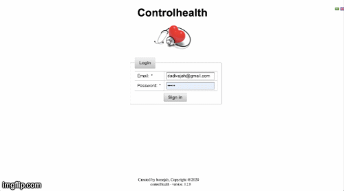

# Controlhealth

<h1 align="center">
  
</h1>

<h1 align="center">
  
</h1>

## Project for you control your health:
* Java 8
* JSF
* Primefaces
* Hibernate
* MySQL8
* Apache Tomcat9
* Maven

## Features
* Login
* Internationalization
* CRUDS:
  * Medical Appointement 
  * Doctor
  * Patient
  * Address
  * Type Address
  * Speciality Type
  * Reports
  * Admin

## Tool converter ascii: 
https://native2ascii.net/

